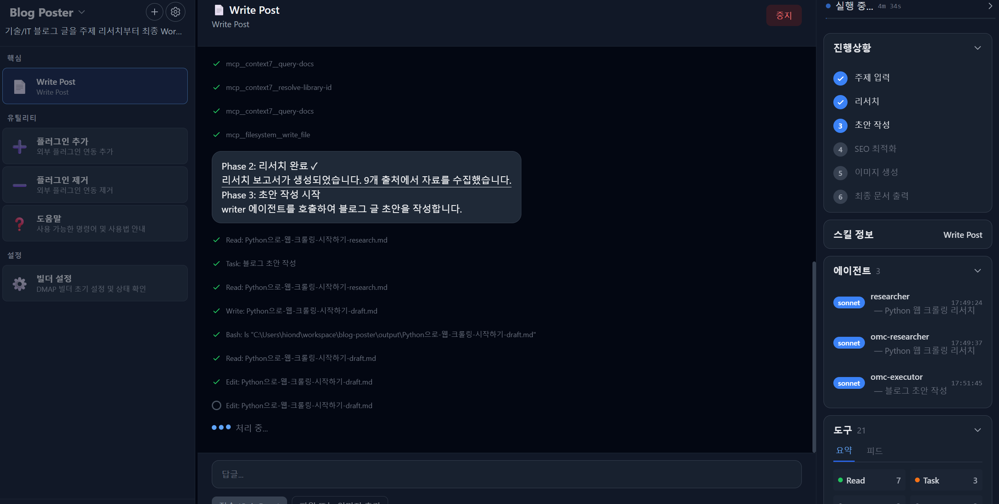

🇰🇷 [한국어](#dmap-빌더) | 🇺🇸 [English](README.en.md)

# DMAP 빌더

> 코드 없이 멀티에이전트 플러그인을 만드는 선언형 프레임워크

- [DMAP 빌더](#dmap-빌더)
  - [개요](#개요)
    - [문제: 기존 멀티에이전트 개발의 불편함](#문제-기존-멀티에이전트-개발의-불편함)
    - [DMAP의 해결 방식](#dmap의-해결-방식)
    - [핵심 가치](#핵심-가치)
  - [빠른 시작](#빠른-시작)
    - [사전 요구사항](#사전-요구사항)
    - [DMAP 빌더 설치](#dmap-빌더-설치)
    - [웹에서 사용](#웹에서-사용)
    - [Claude Code에서 사용](#claude-code에서-사용)
  - [핵심 개념](#핵심-개념)
    - [Skills = 부서장](#skills--부서장)
    - [Agents = 전문가](#agents--전문가)
    - [Gateway = 통역사](#gateway--통역사)
    - [리소스 마켓플레이스 = 사내 공유 드라이브](#리소스-마켓플레이스--사내-공유-드라이브)
    - [아키텍처 (Clean Architecture)](#아키텍처-clean-architecture)
  - [동작 원리](#동작-원리)
    - [프롬프트 조립](#프롬프트-조립)
    - [4-Tier 모델 매핑](#4-tier-모델-매핑)
    - [스킬 활성화 경로](#스킬-활성화-경로)
  - [선언형 A2A (크로스-플러그인 위임)](#선언형-a2a-크로스-플러그인-위임)
    - [기존 A2A vs DMAP 선언형 A2A](#기존-a2a-vs-dmap-선언형-a2a)
    - [동작 방식](#동작-방식)
  - [DMAP 생태계](#dmap-생태계)
  - [플러그인 개발 워크플로우](#플러그인-개발-워크플로우)
  - [프로젝트 구조](#프로젝트-구조)
  - [표준 문서](#표준-문서)
  - [실전 예제](#실전-예제)
    - [에이전트 구성 (5명의 전문가)](#에이전트-구성-5명의-전문가)
    - [스킬 구성 (9개 워크플로우)](#스킬-구성-9개-워크플로우)
  - [로드맵](#로드맵)
  - [라이선스](#라이선스)

---

## 개요

**DMAP (Declarative Multi-Agent Plugin)** 은
코드 없이 **Markdown(프롬프트)과 YAML(설정)만으로**
멀티에이전트 시스템을 정의하는 선언형 플러그인 아키텍처 표준임.

### 문제: 기존 멀티에이전트 개발의 불편함

에이전트 1개는 괜찮지만, 여러 에이전트가 협업해야 하는 순간
복잡도가 폭발적으로 증가함. 기존 방식의 한계는 다음과 같음:

- **높은 진입장벽** -- LangChain, CrewAI, AutoGen 등 프레임워크별 SDK 학습 필요
- **런타임 종속** -- 특정 프레임워크에 강결합되어 이식성이 낮음
- **유지보수 어려움** -- 코드 기반 정의는 변경 시 전체 재작성 필요

> "에이전트를 정의하는 데 꼭 코드가 필요할까?"

### DMAP의 해결 방식

"어떻게(HOW)" 대신 "무엇을(WHAT)"만 선언하는 방식임.
택시 기사에게 경로를 일일이 지시하는 대신 "강남역이요"라고 목적지만 말하는 것과 동일함.

### 핵심 가치

| 가치 | 설명 |
|------|------|
| **선언형 명세** | 코드 대신 Markdown + YAML로 에이전트 정의 |
| **런타임 중립** | Claude Code, Codex CLI 등 어떤 런타임에서든 동작 |
| **관심사 분리** | Skills(라우팅) -> Agents(실행) -> Gateway(매핑) 단방향 의존 |
| **비개발자 접근성** | Markdown 작성 가능하면 누구나 플러그인 구축 가능 |
| **도메인 범용** | 코드 생성, 교육, 문서화, 비즈니스 워크플로우 등 어떤 도메인에도 적용 가능 |

> **현재 버전 안내 (2026.2월)**:
> 현재 DMAP 빌더는 **Claude Code 전용**으로 제공됨.
> DMAP 표준 자체는 런타임 중립적으로 설계되었으며, 향후 Codex CLI, Gemini CLI 등
> **멀티 런타임 지원으로 확장 예정**임.

[Top](#dmap-빌더)

---

## 빠른 시작

### 사전 요구사항

**1. 기본 툴 설치**

| 도구 | 최소 버전 | 용도 |
|------|-----------|------|
| Git | 2.x | 플러그인 마켓플레이스 (GitHub 저장소 클론) |
| Node.js | 18+ | MCP 서버 실행 (`npx` 명령 사용) |
| VS Code | 최신 | 코드 편집기 (`code` 명령 사용) |

**2. PATH 설정**

`~/.local/bin` 디렉토리를 PATH에 추가함:

```bash
# Mac 사용자
code ~/.zshrc

# Linux/Windows 사용자 (Windows는 Git Bash 터미널 사용)
code ~/.bashrc
```

아래 내용을 파일 끝에 추가:

```bash
export PATH=~/.local/bin:$PATH
```

> **(중요)** 경로 추가 후 반드시 `source ~/.bashrc` 또는 `source ~/.zshrc` 실행

**3. Claude Code 설치**

```bash
# macOS/Linux
curl -fsSL https://claude.ai/install.sh | bash

# Windows PowerShell
irm https://claude.ai/install.ps1 | iex
```

설치 후 초기 구성:

```bash
claude
```

**4. Oh My ClaudeCode (OMC) 설치**

Claude Code 프롬프트에서 순차 수행:

```
/plugin marketplace add https://github.com/Yeachan-Heo/oh-my-claudecode
/plugin install oh-my-claudecode
```

Setup 시 MCP는 context7만 설치:

```
/oh-my-claudecode:omc-setup
```

> DMAP 빌더는 OMC의 스킬 부스팅(ralplan, ralph 등)을 활용하므로 OMC 설치가 필수임.

### DMAP 빌더 설치

```bash
claude plugin marketplace add unicorn-plugins/dmap
claude plugin install dmap@unicorn
```

초기 설정: Claude Code 실행 후 
```
/dmap:setup 
```
  
### 웹에서 사용

PC에 DMAP을 클론하고 웹 앱을 실행하면 브라우저에서 DMAP 빌더를 사용할 수 있음.
  

**1. DMAP 클론**

```bash
git clone https://github.com/unicorn-plugins/dmap.git
cd dmap
```

**2. DMAP 웹 실행**

```bash
cd dmap-web
npm install
npm run dev
```

**3. 브라우저에서 사용**

http://localhost:5173 접속 후:

'팀 기획서' 클릭하고 플러그인 개발 시작 

### Claude Code에서 사용

'/dmap:team-planner' 실행하여 팀 기획서 작성 부터 시작    

| 명령 | 설명 |
|------|------|
| `/dmap:develop-plugin` | 4-Phase 워크플로우로 플러그인 개발 |
| `/dmap:team-planner` | 팀 기획서 작성 지원 (AI 자동 완성) |
| `/dmap:publish` | 개발 완료된 플러그인을 GitHub에 배포 |
| `/dmap:add-ext-skill` | 외부호출 스킬(ext-{대상플러그인}) 추가 |
| `/dmap:remove-ext-skill` | 외부호출 스킬(ext-{대상플러그인}) 제거 |
| `/dmap:setup` | 설치 검증 (플러그인 구조 및 표준 문서 확인) |
| `/dmap:help` | 사용 안내 |

기본 사용 흐름:

```
1. /dmap:setup                -- 설치 상태 검증
2. /dmap:team-planner         -- 팀 기획서 작성 (AI 자동 완성)
3. /dmap:develop-plugin       -- 요구사항 -> 설계 -> 개발 -> 검증 자동 수행
4. /dmap:publish              -- GitHub 배포 (저장소 생성, 커밋, 푸시)
```

> **End-to-End 자동화**: 요구사항 정의부터 GitHub 배포까지 전 과정을 AI가 자동 수행함.
> 사용자는 각 단계의 승인만 하면 됨.

[Top](#dmap-빌더)

---

## 핵심 개념

DMAP의 구조를 회사 조직에 비유하면 이해하기 쉬움.

### Skills = 부서장

일을 배분하는 부서장 역할.
사용자의 요청을 받아 어떤 에이전트에게 어떤 일을 시킬지 결정함.
`SKILL.md` 파일 하나로 워크플로우 전체를 선언.

| 항목 | 내용 |
|------|------|
| 핵심 파일 | `skills/{name}/SKILL.md` |
| 역할 | 라우팅 + 오케스트레이션 |
| 유형 | core, setup, orchestrator, planning |

### Agents = 전문가

실제 일을 수행하는 전문가.
각 에이전트는 3개 파일로 구성됨.

| 파일 | 역할 |
|------|------|
| `AGENT.md` | 역할 정의 (목표, 워크플로우, 출력 형식) |
| `agentcard.yaml` | 메타데이터 (이름, 버전, 티어, 제약) |
| `tools.yaml` | 사용 가능한 도구 추상 선언 |

### Gateway = 통역사

추상적인 선언을 구체적인 실행 환경으로 번역하는 통역사.
에이전트가 "파일 검색 도구"라고 선언하면,
Gateway가 실제 런타임에서 어떤 도구를 쓸지 매핑함.

| 파일 | 역할 |
|------|------|
| `install.yaml` | MCP/LSP 서버, 커스텀 도구 설치 선언 |
| `runtime-mapping.yaml` | 티어 매핑, 도구 매핑, 액션 매핑 |

### 리소스 마켓플레이스 = 사내 공유 드라이브

가이드, 템플릿, 샘플, 도구를 모아둔 공유 저장소.
여러 플러그인이 함께 사용할 수 있는 공용 자원 풀.

| 분류 | 경로 | 용도 |
|------|------|------|
| 가이드 | `resources/guides/` | 기술 참조 문서 |
| 템플릿 | `resources/templates/` | 산출물 생성 템플릿 |
| 샘플 | `resources/samples/` | 구현 참고 샘플 |
| 도구 | `resources/tools/` | 커스텀 앱/CLI 도구 |

### 아키텍처 (Clean Architecture)

이 컴포넌트들은 Clean Architecture 원칙을 따름.
Skills -> Agents -> Gateway 순서로 단방향 의존하므로,
각 부분을 독립적으로 수정하거나 교체 가능함.

```
위임형:  Input -> Skills(Controller) -> Agents(Service) -> Gateway -> Runtime
직결형:  Input -> Skills(Controller) ----------------------> Gateway -> Runtime
```

[Top](#dmap-빌더)

---

## 동작 원리

### 프롬프트 조립

DMAP은 3단계 레이어로 프롬프트를 조립함.

| 단계 | 소스 | 내용 |
|------|------|------|
| 1. 공통 정적 | Gateway `runtime-mapping.yaml` | 런타임 공통 설정 (티어 매핑, 도구 매핑) |
| 2. 에이전트별 정적 | `AGENT.md` + `agentcard.yaml` + `tools.yaml` | 에이전트 역할, 메타데이터, 도구 선언 |
| 3. 동적 | 스킬이 전달하는 작업 지시 | 사용자 요청 기반 구체 작업 내용 |

해외여행 가이드북에 비유하면:
기본 정보(공통 규칙) + 목적지별 정보(에이전트 역할) + 오늘의 일정(작업 지시) = 완성된 가이드북.

### 4-Tier 모델 매핑

작업의 복잡도에 따라 4단계로 나누고, 각 단계에 적합한 AI 모델을 배정함.
간단한 파일 검색은 가벼운 모델이, 복잡한 아키텍처 설계는 강력한 모델이 담당함.

| Tier | 용도 | Claude 매핑 예시 |
|------|------|-----------------|
| HEAVY | 극도로 복잡한 추론, 전략 수립 | Opus (max thinking) |
| HIGH | 복잡한 분석, 아키텍처 설계 | Opus |
| MEDIUM | 표준 구현, 일반 작업 | Sonnet |
| LOW | 단순 조회, 파일 검색 | Haiku |

작업 중 난이도가 올라가면 자동으로 상위 모델로 에스컬레이션됨.

### 스킬 활성화 경로

두 가지 경로로 스킬이 활성화됨:

1. **직접 호출** -- 슬래시 명령어(`/dmap:develop-plugin`)로 정확히 원하는 스킬을 호출
2. **Core 경유** -- 모호한 요청이 들어오면 Core 스킬이 의도를 분석하여 적절한 스킬로 라우팅

런타임은 `skills/` 디렉토리를 자동 스캔하여 사용 가능한 스킬을 발견함.

[Top](#dmap-빌더)

---

## 선언형 A2A (크로스-플러그인 위임)

DMAP은 플러그인 간 협업을 **External 스킬(ext-{})** 패턴으로 해결함.
기존 A2A(Agent-to-Agent) 프로토콜이 HTTP 엔드포인트, Agent Card, 메시지 버스 등
인프라를 요구하는 반면, DMAP은 **마크다운 한 장**으로 크로스-플러그인 위임을 구현함.

### 기존 A2A vs DMAP 선언형 A2A

| 비교 항목 | 기존 A2A (Google A2A 등) | DMAP 선언형 A2A |
|-----------|:----------------------:|:--------------:|
| 통신 방식 | HTTP/JSON-RPC 엔드포인트 | Skill→Skill 호출 (FQN) |
| 인터페이스 선언 | Agent Card (JSON) | 플러그인 명세서 (Markdown) |
| 인프라 요구사항 | 서비스 디스커버리, 메시지 버스 | 없음 (Zero Infrastructure) |
| 연동 코드 | SDK 기반 클라이언트 코드 | ext-{} 스킬 자동 생성 |
| 라이프사이클 관리 | 수동 구현 | add/remove-ext-skill 유틸리티 |

### 동작 방식

1. **플러그인 명세서 공개** — 대상 플러그인이 리소스 마켓플레이스에 명세서(FQN, ARGS 스키마, 실행 경로)를 등록
2. **ext-{} 스킬 생성** — `/add-ext-skill` 유틸리티로 명세서 기반 External 스킬 자동 생성
3. **Skill→Skill 위임** — 호출 측이 도메인 컨텍스트를 수집하여 FQN으로 대상 스킬 호출
4. **라이프사이클 관리** — `/remove-ext-skill`로 더 이상 필요 없는 연동을 깔끔하게 제거

```
Traditional A2A:  HTTP endpoints + Agent Card + Message Bus + SDK client
DMAP A2A:         Markdown spec  + ext-{} skill + Skill tool call
```

> **핵심 철학**: "가장 좋은 인프라는 없는 인프라" —
> 프로토콜이 아닌 **문서 기반 계약(Contract)**으로 플러그인 간 협업을 실현함.

[Top](#dmap-빌더)

---

## DMAP 생태계

DMAP 생태계는 **DMAP 빌더 → AI팀(플러그인) → 외부 플러그인 → AI 서비스**의 계층으로 구성됨.
각 AI팀은 필요한 외부 플러그인을 자유롭게 탈착(Plug & Unplug)하여 역량을 확장함.

```
┌─────────────────────────────────────────────┐
│              DMAP 빌더                       │
│         (멀티에이전트 플러그인 생성기)          │
└──────────────────┬──────────────────────────┘
                   │ 생성
        ┌──────────┼──────────┐
        ▼          ▼          ▼
  ┌──────────┐ ┌──────────┐ ┌──────────┐
  │blog-poster│ │curriculum│ │   ...    │
  │  AI팀    │ │  AI팀    │ │  AI팀    │
  └────┬─────┘ └────┬─────┘ └────┬─────┘
       │  ext-{}    │  ext-{}    │  ext-{}
       │  탈착      │  탈착      │  탈착
       ▼            ▼            ▼
  ┌─────────────────────────────────────────┐
  │         외부 플러그인 풀                  │
  │  ┌───────┐ ┌────────────────────┐       │
  │  │ Abra  │ │github-release-mgr  │  ...  │
  │  │(개발) │ │(릴리스)            │       │
  │  └───────┘ └────────────────────┘       │
  └─────────────────────────────────────────┘
```

| 현실 세계 비유 | DMAP 생태계 | 역할 |
|--------------|------------|------|
| 인력파견 회사 | DMAP 빌더 | 멀티에이전트 플러그인 생성기 |
| 프로젝트 투입 팀 | 목적별 플러그인 | AI팀 (도메인 전문가 집단) |
| 팀이 사용하는 외부 도구 | 외부 플러그인 (ext-{}) | 필요에 따라 탈착하는 확장 모듈 |
| 팀이 납품한 서비스 | AI 서비스 | AI팀이 만든 결과물 |

> 상세 문서: [DMAP 생태계 구조](https://github.com/unicorn-plugins/dmap/blob/main/docs/idea/dmap-ecosystem.md)

[Top](#dmap-빌더)

---

## 플러그인 개발 워크플로우

요구사항 정의부터 GitHub 배포까지 **End-to-End 자동화**로 수행됨.
`/dmap:team-planner`로 팀 기획서를 먼저 작성한 후,
`/dmap:develop-plugin`으로 4-Phase 워크플로우를 자동 수행하고,
`/dmap:publish`로 GitHub에 배포함. 각 Phase 완료 시 사용자 승인을 받아 다음 단계로 진행함.

```
/dmap:team-planner → /dmap:develop-plugin (Phase 1~4) → /dmap:publish
```

| Phase | 단계 | 주요 활동 |
|:-----:|------|----------|
| 1 | 요구사항 수집 | 팀 기획서 분석, 플러그인 적합여부 판단, 누락 정보 수집 ([샘플](https://github.com/unicorn-plugins/abra/blob/main/output/requirement.md)) |
| 2 | 설계 및 계획 | 공유 자원 선택, 플러그인 구조 설계, 개발 계획서 작성 |
| 3 | 플러그인 개발 | 스켈레톤 생성, Gateway/Agent/Skill/Command 개발, README 작성 |
| 4 | 검증 및 완료 | DMAP 표준 준수 검증, 최종 보고, 공유자원 등록(선택) |

**Phase 3 개발 순서:**

1. 플러그인 스켈레톤 생성 (`.claude-plugin/`, 디렉토리 구조)
2. Gateway 설정 (`install.yaml`, `runtime-mapping.yaml`)
3. 공유자원 복사 (리소스 마켓플레이스 -> 플러그인 디렉토리)
4. 에이전트 개발 (`AGENT.md`, `agentcard.yaml`, `tools.yaml`)
5. 스킬 개발 (setup 필수, help 권장, 기능 스킬)
6. `commands/` 진입점 생성
7. 커스텀 앱/CLI 개발 (필요 시)
8. `README.md` 작성

[Top](#dmap-빌더)

---

## 프로젝트 구조

```
dmap/
├── .claude-plugin/          # 플러그인 매니페스트
│   ├── plugin.json          #   플러그인 메타데이터
│   └── marketplace.json     #   마켓플레이스 등록 정보
├── standards/               # DMAP 표준 문서
│   ├── plugin-standard.md          # 메인 표준 (아키텍처, 디렉토리, 배포)
│   ├── plugin-standard-agent.md    # Agent 패키지 표준
│   ├── plugin-standard-skill.md    # Skill 작성 표준
│   └── plugin-standard-gateway.md  # Gateway 설정 표준
├── resources/               # 리소스 마켓플레이스 (공유 자원 풀)
│   ├── plugin-resources.md  #   리소스 카탈로그
│   ├── guides/              #   가이드 문서
│   ├── templates/           #   템플릿 파일
│   ├── samples/             #   샘플 파일
│   └── tools/               #   도구 (커스텀 앱/CLI)
├── skills/                  # DMAP 빌더 스킬
│   ├── develop-plugin/      #   플러그인 개발 (4-Phase)
│   ├── team-planner/        #   팀 기획서 작성 지원
│   ├── publish/             #   GitHub 배포
│   ├── add-ext-skill/       #   외부호출 스킬 추가 유틸리티
│   ├── remove-ext-skill/    #   외부호출 스킬 제거 유틸리티
│   ├── ext-{plugin}/        #   외부 플러그인 위임 (선언형 A2A)
│   ├── setup/               #   초기 설정
│   └── help/                #   사용 안내
├── commands/                # 슬래시 명령 진입점
│   ├── develop-plugin.md
│   ├── team-planner.md
│   ├── publish.md
│   ├── add-ext-skill.md
│   ├── remove-ext-skill.md
│   ├── ext-{plugin}.md
│   ├── setup.md
│   └── help.md
├── references/              # 참조 문서
└── docs/                    # 발표/논문 자료
```

[Top](#dmap-빌더)

---

## 표준 문서

DMAP 표준은 4개의 핵심 문서와 리소스 카탈로그로 구성됨.

| 문서 | 경로 | 설명 |
|------|------|------|
| 메인 표준 | `standards/plugin-standard.md` | 아키텍처, 디렉토리 구조, 네임스페이스, 배포 |
| Agent 표준 | `standards/plugin-standard-agent.md` | 에이전트 패키지 구성 (AGENT.md, agentcard.yaml, tools.yaml) |
| Skill 표준 | `standards/plugin-standard-skill.md` | 스킬 유형, 작성 규칙, 유형별 템플릿 |
| Gateway 표준 | `standards/plugin-standard-gateway.md` | install.yaml, runtime-mapping.yaml 작성 규칙 |
| 리소스 카탈로그 | `resources/plugin-resources.md` | 공유 자원 목록 (가이드, 템플릿, 샘플, 도구) |
| 플러그인 개발 가이드 | `resources/guides/plugin/plugin-dev-guide.md` | 4-Phase 워크플로우 상세 가이드 |

[Top](#dmap-빌더)

---

## 실전 예제

**abra 플러그인** -- Dify 워크플로우 DSL 자동화 플러그인.
Dify 플랫폼의 DSL(Domain Specific Language)을 자동 생성하고
프로토타이핑까지 수행하는 플러그인임.

Git Repository: https://github.com/unicorn-plugins/abra.git

### 에이전트 구성 (5명의 전문가)

| 에이전트 | 역할 |
|----------|------|
| scenario-analyst | 요구사항 분석, 시나리오 작성 |
| dsl-architect | Dify DSL 코드 설계 |
| plan-writer | 개발계획서 작성 |
| prototype-runner | Dify 프로토타이핑 실행 |
| agent-developer | 최종 Agent 코드 개발 |

### 스킬 구성 (9개 워크플로우)

| 스킬 | 용도 |
|------|------|
| setup | 초기 환경 설정 |
| core | 자연어 라우팅 |
| help | 사용 안내 (즉시 출력) |
| dify-setup | Dify Docker 환경 구축 |
| scenario | 요구사항 시나리오 생성 |
| dsl-generate | Dify DSL 자동 생성 |
| prototype | Dify 프로토타이핑 자동화 |
| dev-plan | 개발계획서 작성 |
| develop | AI Agent 개발 및 배포 |

사용자 플로우: 시나리오 생성 -> DSL 생성 -> 프로토타이핑 -> 개발계획 -> Agent 개발

[Top](#dmap-빌더)

---

## 로드맵

| 단계 | 목표 | 내용 |
|------|------|------|
| **현재** | Claude Code 기반 안정화 | Claude Code 런타임에서 DMAP 표준 기반 플러그인 개발 및 실행 |
| **단기** | 다중 런타임 지원 | Codex CLI, Gemini CLI 등 다양한 실행 환경 지원 |
| **중기** | 마켓플레이스 / 커뮤니티 | 플러그인 공유 마켓플레이스 구축, 오픈소스 커뮤니티 생태계 조성 |
| **장기** | 노코드 UI | 비개발자용 시각적 플러그인 빌더 (드래그 앤 드롭) |

[Top](#dmap-빌더)

---

## 라이선스

MIT License

Copyright (c) 2026 Unicorn Inc.
https://github.com/unicorn-plugins/dmap

[Top](#dmap-빌더)

