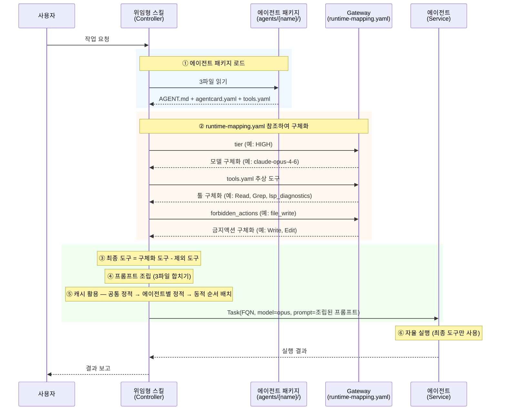

# DMAP 빌더 표준

- [DMAP 빌더 표준](#dmap-빌더-표준)
  - [DMAP 빌더란?](#dmap-빌더란)
    - [정의](#정의)
    - [핵심 가치](#핵심-가치)
    - [기존 프레임워크와의 차별성](#기존-프레임워크와의-차별성)
  - [핵심 원칙](#핵심-원칙)
  - [5-Layer 아키텍처](#5-layer-아키텍처)
    - [런타임 (Runtime)](#런타임-runtime)
  - [문서 참조 규칙](#문서-참조-규칙)
  - [핵심 규칙](#핵심-규칙)
    - [MUST 규칙](#must-규칙)
    - [MUST NOT 규칙](#must-not-규칙)
  - [4-Tier 에이전트 모델](#4-tier-에이전트-모델)
  - [플러그인 디렉토리 구조](#플러그인-디렉토리-구조)
    - [최소 필수 구조](#최소-필수-구조)
    - [표준 전체 구조](#표준-전체-구조)
  - [네임스페이스](#네임스페이스)
    - [네임스페이스 형식](#네임스페이스-형식)
    - [네임스페이스 적용 방식](#네임스페이스-적용-방식)
    - [슬래시 명령 등록](#슬래시-명령-등록)
    - [충돌 해소 우선순위](#충돌-해소-우선순위)
  - [배포](#배포)
    - [plugin.json](#pluginjson)
    - [marketplace.json](#marketplacejson)
      - [루트 레벨](#루트-레벨)
      - [plugins 배열 항목](#plugins-배열-항목)
      - [source 타입](#source-타입)
      - [CLI 명령](#cli-명령)
    - [README.md 필수 섹션](#readmemd-필수-섹션)
  - [빠른 참조](#빠른-참조)

---

## DMAP 빌더란?

### 정의

**DMAP (Declarative Multi-Agent Plugin)**은
코드 없이 **Markdown(프롬프트)과 YAML(설정)만으로** 멀티에이전트 시스템을 정의하는 선언형 플러그인 아키텍처 표준임.

소프트웨어 공학의 검증된 원칙(Clean Architecture)을 LLM 에이전트 오케스트레이션에 적용하여,
런타임 중립적이고 도메인 무관한 플러그인을 구축할 수 있음.

**DMAP 빌더**는 이 표준에 따라 플러그인을 생성하는 AI 에이전트(또는 도구)를 의미함.

### 핵심 가치

| 가치 | 설명 |
|------|------|
| **선언형 명세** | "어떻게 동작하는가"를 코딩하지 않고 "무엇을 할 수 있는가"를 선언 |
| **런타임 중립** | `tier: HIGH` 같은 추상 선언 → 런타임(Claude Code, Codex CLI 등)이 구체 모델로 해석 |
| **관심사 분리** | Skills(라우팅) → Agents(실행) → Gateway(도구 매핑)의 단방향 의존 |
| **비개발자 접근성** | Markdown과 YAML만 알면 도메인 전문가도 에이전트 시스템 구축 가능 |
| **도메인 범용** | 코드 생성, 교육, 문서화, 비즈니스 워크플로우 등 어떤 도메인에도 적용 가능 |

### 기존 프레임워크와의 차별성

| 비교 항목 | 기존 프레임워크 (LangChain, CrewAI, AutoGen 등) | **DMAP** |
|-----------|:-----------------------------------------------:|:--------:|
| **에이전트 정의** | Python/TypeScript SDK 코드 | Markdown + YAML |
| **오케스트레이션** | 그래프/함수 호출 체인 코드 | 스킬 프롬프트(자연어) |
| **런타임 종속성** | 특정 SDK에 강결합 | 런타임 중립 |
| **아키텍처 원칙** | 없거나 프레임워크 의존 | Clean Architecture |
| **도구 연결** | 코드에서 도구 객체 생성 | 추상 선언(tools.yaml) → Gateway 매핑 |
| **티어 관리** | 없음 | 4-Tier(HEAVY/HIGH/MEDIUM/LOW) + 런타임 자동 매핑 |
| **역할 제약** | if문으로 분기 | forbidden_actions 블랙리스트 선언 |
| **이식성** | 낮음 (전체 재작성) | 높음 (runtime-mapping.yaml만 교체) |

**패러다임 전환:**

```
기존:  Developer writes Python code  → Framework executes agents
DMAP:  Anyone writes Markdown/YAML   → Any Runtime executes agents
```

[Top](#dmap-빌더-표준)

---

## 핵심 원칙

| 원칙 | 의미 |
|------|------|
| **선언형** | Markdown(프롬프트) + YAML(설정)만으로 에이전트 시스템 정의 |
| **런타임 중립** | 추상 선언(agentcard.yaml, tools.yaml) ↔ 구체 매핑(runtime-mapping.yaml) 분리 (Dependency Inversion) |
| **Clean Architecture** | 위임형: Skills → Agents → Gateway 단방향 의존. 직결형: Skills → Gateway 직접 접근 허용. Hooks가 횡단적 개입(AOP) |
| **YAGNI** | 필요하지 않은 계층은 생략 — 직결형 스킬(Setup, Utility)에 Agent 위임을 강제하지 않음 |

> YAGNI(You Aren't Gonna Need It): 불필요한 걸 미리 만들지 말라는 XP 설계 철학
  
[Top](#dmap-빌더-표준)

---

## 5-Layer 아키텍처

| Layer | Clean Architecture | 역할 | 핵심 파일 | 상세 문서 |
|-------|-------------------|------|----------|----------|
| Input | — | 외부(사용자/API 등) 요청 | — | — |
| Controller + UseCase | Skills | 라우팅 + 오케스트레이션 | SKILL.md | [→ Skill 상세](plugin-standard-skill.md) |
| Service | Agents | 전문가 자율 실행 | AGENT.md, agentcard.yaml, tools.yaml | [→ Agent 상세](plugin-standard-agent.md) |
| Gateway | 도구 인프라 | 추상→구체 매핑 | runtime-mapping.yaml | [→ Gateway 상세](plugin-standard-gateway.md) |
| Runtime | 실행 환경 | 매핑 해석 + 에이전트 스폰 | — | 아래 [런타임](#런타임-runtime) 참조 |
| Cross-cutting | Hooks (AOP) | 모든 계층의 이벤트 횡단적 가로챔 | hooks.json | — |

**스킬 실행 경로:**
```
위임형:  Input → Skills(Controller) → Agents(Service) → Gateway → Runtime
직결형:  Input → Skills(Controller) ──────────────────→ Gateway → Runtime
                                                         ↑
                                              Hooks (Cross-cutting, AOP)
```

**컴포넌트별 역할:**

| 컴포넌트 | 역할 | 트리거 방식 |
|----------|------|-------------|
| **Skills** | 사용자 진입점. 위임형: 오케스트레이션 → Agent 위임, 직결형: Gateway 직접 사용 | 명시적 호출 |
| **Agents** | 역할별 전문가 — 위임받은 작업을 자율 수행 | Skills가 위임 |
| **Hooks** | 시스템 이벤트 가로채기 (감시·강제·로깅) | 이벤트 구동 (자동) |
| **Gateway** | 외부 도구·API를 추상 인터페이스로 제공 | 상시 대기 |
| **Runtime** | 매핑 해석 → 컨텍스트 조립 → 에이전트 스폰/실행 | 백그라운드 |

**위임형 스킬의 에이전트 구동 흐름:**



**Gateway 세분류:**

| 유형 | 도구 | 대응 시스템 |
|------|------|-----------|
| File | Read, Write, Edit, Glob, Grep | 파일 시스템 |
| Shell | Bash | 터미널 / OS |
| Web | WebSearch, WebFetch | 웹 / 검색엔진 |
| MCP | context7, exa, playwright 등 | 외부 API, DB, 브라우저 |
| LSP | diagnostics, hover, references | IDE 수준 언어 분석 |
| Custom | AST grep, Python REPL, state, notepad | 플러그인 자체 확장 도구 |

### 런타임 (Runtime)

런타임은 에이전트를 스폰하고 실행하는 환경으로, Gateway의 매핑 테이블을 참조하여 추상 선언을 구체 구현으로 변환함.

**런타임 유형:**

| 런타임 | 제공자 | 특징 |
|--------|--------|------|
| Claude Code | Anthropic | CLI 기반, MCP/LSP 지원 |
| Codex CLI | OpenAI | CLI 기반 에이전트 실행 |
| Gemini CLI | Google | CLI 기반 에이전트 실행 |
| Cursor, Windsurf | 3rd party | IDE 기반 에이전트 실행 |

**매핑 해석 방식:**

| 유형 | 해석 방식 | 예시 |
|------|----------|------|
| **LLM 런타임** | 프롬프트 기반 — 핵심 스킬이 매핑 참조 가이드를 포함 | Claude Code, Codex CLI |
| **코드 런타임** | 프로그래밍 기반 — YAML을 파싱하여 자동 해석 | IDE 플러그인, 커스텀 런타임 |

**런타임 자동 처리 (스킬이 제어 불가):**
- **캐시 최적화**: prefix 캐싱, 일괄 로드, mtime/TTL 기반 무효화
- **핸드오프/에스컬레이션**: agentcard.yaml의 조건에 따라 자동 처리

> **원칙**: 런타임은 표준의 추상 선언을 **해석만** 함 — 표준을 변경하지 않음.
> 매핑 테이블에 없는 추상 선언은 런타임 기본값으로 처리.

[Top](#dmap-빌더-표준)

---

## 문서 참조 규칙

AI가 작업별로 로드할 문서를 정의함. 이미 로드한 문서는 재로드하지 않음.

| 작업 유형 | 로드할 문서 | 토큰 규모 |
|----------|-----------|----------|
| 스킬 생성·수정 | `standards/plugin-standard-skill.md` | ~8,000 |
| 에이전트 생성·수정 | `standards/plugin-standard-agent.md` | ~8,000 |
| Gateway·도구 매핑 | `standards/plugin-standard-gateway.md` | ~6,000 |
| 전체 플러그인 신규 생성 | 위 문서 전체를 순차 로드 | ~22,000 |

[Top](#dmap-빌더-표준)

---

## 핵심 규칙

### MUST 규칙

| # | 규칙 | 근거 |
|---|------|------|
| 1 | 모든 플러그인은 `.claude-plugin/plugin.json` 포함 | 런타임 인식 진입점 |
| 2 | 모든 에이전트는 AGENT.md(프롬프트) + agentcard.yaml(메타데이터) 쌍으로 구성 | 프롬프트/메타데이터 분리 |
| 3 | tier는 HEAVY / HIGH / MEDIUM / LOW 중 하나만 사용 | 런타임 매핑 표준 |
| 4 | 위임형 스킬(Core, Planning, Orchestrator)은 라우팅+오케스트레이션만 수행, 작업 실행은 에이전트에 위임. 직결형 스킬(Setup, Utility)은 Gateway 직접 사용 허용 | 관심사 분리 + 실용성 |
| 5 | Skill→Agent 위임은 Task 도구, Skill→Skill 위임은 Skill 도구 사용 | 위임 메커니즘 구분 |
| 6 | 추상 선언(tools.yaml)과 구체 매핑(runtime-mapping.yaml) 분리 | Dependency Inversion |
| 7 | 스킬 네임스페이스는 `{plugin-name}:{skill-name}` 형식 | 충돌 방지 |
| 8 | `/{plugin-name}:{skill-name}` 형식의 진입점 위해 커맨드 생성 | 슬래시 명령 노출 |
| 9 | setup 스킬 반드시 포함 | 설치/라우팅 등록 |
| 10 | AGENT.md에 도구 명세 금지 — tools.yaml에 분리 | 프롬프트/도구 분리 |

### MUST NOT 규칙

| # | 금지 사항 | 이유 |
|---|----------|------|
| 1 | 스킬이 직접 애플리케이션 코드 작성·수정 (직결형 스킬의 설정 파일·문서 작업은 예외) | 에이전트의 역할 침범 |
| 2 | 에이전트가 직접 라우팅·오케스트레이션 | 스킬의 역할 침범 |
| 3 | agentcard.yaml에 프롬프트 내용 포함 | 기계 판독용 데이터와 프롬프트 혼재 |
| 4 | AGENT.md에 모델명·도구명 하드코딩 | 런타임 중립성 위반 |
| 5 | 일반 플러그인에서 Hook 사용 | 오케스트레이션 플러그인(OMC) 전용 영역 |

[Top](#dmap-빌더-표준)

---

## 4-Tier 에이전트 모델

동일 역할을 비용-역량 트레이드오프에 따라 티어별로 분리하는 원칙.
티어는 LLM 모델 등급을 결정하는 추상 선언이며, Gateway의 `runtime-mapping.yaml`이 실제 모델로 매핑함.

| 티어 | LLM 모델 | 특성 | 적합 작업 | 에스컬레이션 |
|------|---------|------|----------|-------------|
| LOW | Haiku | 빠르고 저비용 | 단건 조회, 간단한 수정 | 복잡도 초과 시 상위 티어로 보고 |
| MEDIUM | Sonnet | 균형 | 기능 구현, 일반 분석 | — |
| HIGH | Opus | 최고 역량, 고비용 | 복잡한 의사결정, 심층 분석 | — |
| HEAVY | Opus (대규모 예산) | 최고 역량 + 대규모 토큰·시간 | 장시간 추론, 대규모 멀티파일 작업 | — |

**핵심 메커니즘:**
- **에스컬레이션**: LOW가 자기 한계 인식 → 상위 티어로 보고
- **상속**: 티어 변형 에이전트가 기본 에이전트의 config를 상속, 오버라이드만 기술
- **런타임 매핑**: 스킬이 에이젼트 호출 시 실제 모델로 변환하여 에이젼트에 전달 

[Top](#dmap-빌더-표준)

---

## 플러그인 디렉토리 구조

### 최소 필수 구조

```
my-plugin/
├── .claude-plugin/
│   └── plugin.json            # 플러그인 매니페스트 (유일한 필수 파일)
```

### 표준 전체 구조

```
my-plugin/
├── .claude-plugin/             # 플러그인 메타데이터 (필수)
│   ├── plugin.json             # 매니페스트: name, description, version 등
│   └── marketplace.json        # 마켓플레이스 매니페스트 (배포 시 필요)
│
├── skills/                     # 스킬 정의 (필수, 자동 탐색)
│   ├── skill-name/
│   │   ├── SKILL.md            # 메인 지시 파일 (스킬당 필수)
│   │   ├── scripts/            # 실행 스크립트 (선택)
│   │   ├── references/         # 참고 문서 (선택)
│   │   └── assets/             # 템플릿, 바이너리 (선택)
│
├── agents/                      # 에이전트 정의 (필수, 자동 탐색)
│   └── agent-name/             # 에이전트 패키지 (디렉토리)
│       ├── AGENT.md            # 프롬프트 (필수)
│       ├── agentcard.yaml         # 역량·제약·핸드오프 (필수)
│       └── tools.yaml          # 필요 도구 선언 (선택)
│
├── gateway/                    # 도구 인프라 및 런타임 매핑 (필수)
│   ├── install.yaml            # 설치 매니페스트 (필수)
│   ├── runtime-mapping.yaml    # 티어·도구·액션 매핑 (필수)
│   ├── mcp/                    # MCP 서버 설정 (선택)
│   ├── lsp/                    # LSP 서버 설정 (선택)
│   └── tools/                  # 커스텀 도구 (선택)
│
├── commands/                   # 슬래시 명령 진입점 (필수)
│   └── skill-name.md           # 스킬별 슬래시 명령 등록 (YAML frontmatter + 위임)
│
├── hooks/                      # 이벤트 핸들러 (선택, 자동 탐색)
│   └── hooks.json              # Hook 이벤트 → 스크립트 매핑
│
├── README.md                   # 사용 가이드 (배포 시 필수)
└── package.json                # NPM 패키지 (선택. NPM 배포 시에만 필요)
```

[Top](#dmap-빌더-표준)

---

## 네임스페이스

### 네임스페이스 형식

| 항목 | 형식 | 예시 |
|------|------|------|
| 스킬 전체 이름 | `{plugin-name}:{skill-dir-name}` | `abra:scenario` |
| 사용자 호출 | `/{plugin-name}:{skill-dir-name}` | `/abra:scenario` |

### 네임스페이스 적용 방식

`plugin.json`의 `name` 필드가 네임스페이스 접두사로 사용됨.
스킬의 이름은 `skills/` 하위 디렉토리명으로 결정됨.

```
plugin.json:     { "name": "abra" }
스킬 디렉토리:    skills/setup/SKILL.md
→ 슬래시 명령:    /abra:setup  ✅
```

### 슬래시 명령 등록

사용자가 `/plugin-name:skill-name` 형식으로 호출하려면
`commands/` 디렉토리에 진입점 파일 필요. commands 파일이 없으면 슬래시 명령 목록에 표시되지 않음.

```
commands/setup.md
─────────────────
---
description: Abra 플러그인 초기 설정
---

Use the Skill tool to invoke the `abra:setup` skill with all arguments passed through.
```

### 충돌 해소 우선순위

| 우선순위 | 출처 | 설명 |
|---------|------|------|
| 1 (최고) | 플랫폼 내장 명령 | `/help`, `/clear` 등 — 제외 목록으로 보호 |
| 2 | Enterprise | 조직 관리 설정으로 배포된 스킬 |
| 3 | Personal | `~/.claude/skills/` 디렉토리에 정의된 스킬 |
| 4 | Project | 프로젝트 `.claude/skills/` 디렉토리에 정의된 스킬 |
| 5 (최저) | 플러그인 | 플러그인 패키지에 포함된 스킬 (`plugin-name:skill-name` 형식) |

[Top](#dmap-빌더-표준)

---

## 배포

플러그인을 외부에 배포할 때 필요한 파일과 규칙.

### plugin.json

`.claude-plugin/plugin.json`에 플러그인 매니페스트를 선언함.
파일이 없으면 Claude Code가 디렉토리 이름에서 `name`을 자동 추론함.

| 항목 | 필수 | 설명 |
|------|:----:|------|
| `name` | 필수 | 플러그인 고유 식별자. kebab-case, 공백 불가. 예: `"abra"` |
| `version` | 권고 | 시맨틱 버전. marketplace.json의 version보다 우선. 예: `"1.0.0"` |
| `description` | 권고 | 플러그인 목적 설명. 한 줄 요약. 예: `"AI Agent 자동 생성 플러그인"` |
| `author` | 권고 | 작성자 정보 객체. `name`(필수), `email`, `url` 포함 |
| `homepage` | 선택 | 문서 URL. 예: `"https://github.com/cna-bootcamp/abra"` |
| `repository` | 선택 | 소스 코드 URL. 예: `"https://github.com/cna-bootcamp/abra"` |
| `license` | 권고 | SPDX 라이선스 식별자. 예: `"MIT"`, `"Apache-2.0"` |
| `keywords` | 권고 | 검색용 태그 배열. 예: `["dify", "ai-agent", "automation"]` |
| `commands` | 선택 | 추가 커맨드 파일/디렉토리 경로. `./`로 시작하는 상대 경로. 기본: `commands/` |
| `agents` | 선택 | 추가 에이전트 파일 경로. 기본: `agents/` |
| `skills` | 선택 | 추가 스킬 디렉토리 경로. 기본: `skills/` |
| `hooks` | 선택 | Hook 설정 경로 또는 인라인 설정. 기본: `hooks/hooks.json` |
| `mcpServers` | 선택 | MCP 서버 설정 경로 또는 인라인 설정. 기본: `.mcp.json` |
| `lspServers` | 선택 | LSP 서버 설정 경로 또는 인라인 설정. 기본: `.lsp.json` |
| `outputStyles` | 선택 | 출력 스타일 파일/디렉토리 경로 |

> **경로 규칙**: 모든 경로는 `./`로 시작하는 상대 경로.
> 커스텀 경로는 기본 디렉토리를 **대체하지 않고 Add**함.
> `${CLAUDE_PLUGIN_ROOT}` 환경변수로 플러그인 루트 절대 경로 참조 가능.

**예제** (`samples/abra/.claude-plugin/plugin.json`):

```json
{
  "name": "abra",
  "version": "1.0.0",
  "description": "자연어 한마디로 AI Agent를 자동 생성하는 DMAP 플러그인",
  "author": {
    "name": "Lee HaeKyung"
  },
  "repository": "https://github.com/cna-bootcamp/abra",
  "homepage": "https://github.com/cna-bootcamp/abra",
  "license": "MIT",
  "keywords": ["abra", "dmap", "plugin", "multi-agent", "orchestration", "automation"]
}
```
  
### marketplace.json

`.claude-plugin/marketplace.json`에 마켓플레이스 카탈로그를 선언함.
하나의 마켓플레이스에 여러 플러그인을 등록할 수 있음.

**참조**: [Plugin Marketplaces](https://code.claude.com/docs/en/plugin-marketplaces)

#### 루트 레벨

| 항목 | 필수 | 설명 |
|------|:----:|------|
| `$schema` | 권고 | 스키마 참조 URL. `"https://anthropic.com/claude-code/marketplace.schema.json"` |
| `name` | 필수 | 마켓플레이스 식별자. kebab-case, 공백 불가. 예: `"unicorn"` |
| `description` | 선택 | 마켓플레이스 설명. 예: `"Unicorn Inc. 플러그인 모음집"` |
| `owner` | 필수 | 관리자 정보 객체 |
| `owner.name` | 필수 | 관리자 이름. 예: `"Unicorn Inc."` |
| `owner.email` | 권고 | 연락처 이메일. 예: `"dev@unicorn-inc.com"` |
| `plugins` | 필수 | 플러그인 목록 배열 |

> **작성가이드**    
> - **예약된 이름** (사용 불가): `claude-code-marketplace`, `claude-code-plugins`,  
> `claude-plugins-official`, `anthropic-marketplace`, `anthropic-plugins`, `agent-skills`  
> - $schema, name, owner.email만 작성. name은 plugin이름과 동일하게 작성    

#### plugins 배열 항목
| 항목 | 필수 | 설명 |
|------|:----:|------|
| `name` | 필수 | 플러그인 식별자. kebab-case. 예: `"abra"` |
| `source` | 필수 | 플러그인 소스 경로 또는 객체. 상대 경로: `"./"`  GitHub: `{"source":"github","repo":"owner/repo","ref":"v1.0","sha":"..."}` |
| `version` | 선택 | 플러그인 버전. plugin.json의 version이 우선. 예: `"1.0.0"` |
| `description` | 선택 | 플러그인 설명 |
| `author` | 선택 | 작성자 정보 객체. `name`(필수), `email`(선택) |
| `homepage` | 선택 | 문서 URL |
| `repository` | 선택 | 소스 코드 URL |
| `license` | 선택 | SPDX 라이선스 식별자 |
| `keywords` | 선택 | 검색용 태그 배열 |
| `category` | 권고 | 플러그인 카테고리. 예: `"productivity"`, `"development"` |
| `tags` | 선택 | 추가 태그 배열 |
| `strict` | 선택 | 병합 동작 (기본: `true`). `true`: marketplace 항목이 plugin.json과 병합. `false`: marketplace 항목이 전체 정의 |

> **작성가이드**: name, source, category 만 작성 
  
#### source 타입

| 타입 | 형식 | 설명 |
|------|------|------|
| 상대 경로 | 문자열 | 마켓플레이스 루트 기준 상대 경로 |
| GitHub | 객체 | GitHub 저장소에서 가져옴. `sha` 필수 |
| Git URL | 객체 | 임의 Git URL에서 가져옴. `sha` 필수 |

> **작성가이드**: 상대경로로 작성하고 값은 `"./"`
   
**상대 경로** — `"./"`: 루트 자체가 플러그인 (1:1 구조), `"./plugins/abra"`: 하위 디렉토리 (1:N 구조)

```json
// 1:1 구조 (마켓플레이스 = 플러그인)
{ "source": "./" }

// 1:N 구조 (마켓플레이스 아래 여러 플러그인)
{ "source": "./plugins/abra" }
```

**GitHub** — `repo`: `owner/repo` 형식, `ref`: 브랜치·태그·커밋, `sha`: 커밋 해시

```json
{
  "source": {
    "source": "github",
    "repo": "cna-bootcamp/abra",
    "ref": "v1.0.0",
    "sha": "a1b2c3d4e5f6a7b8c9d0e1f2a3b4c5d6e7f8a9b0"
  }
}
```

**Git URL** — `url`: `.git`으로 끝나는 전체 URL, `ref`: 브랜치·태그, `sha`: 커밋 해시

```json
{
  "source": {
    "source": "url",
    "url": "https://gitlab.com/team/plugin.git",
    "ref": "main",
    "sha": "a1b2c3d4e5f6a7b8c9d0e1f2a3b4c5d6e7f8a9b0"
  }
}
```

**예제** (`samples/abra/.claude-plugin/marketplace.json`):

```json
{
  "$schema": "https://anthropic.com/claude-code/marketplace.schema.json",
  "name": "abra",
  "owner": {
    "name": "Unicorn Inc."
  },
  "plugins": [
    {
      "name": "abra",
      "version": "1.0.0",
      "source": "./"
    }
  ]
}
```

#### CLI 명령

```bash
# 마켓플레이스 등록
claude plugin marketplace add <경로-또는-repo>

# 플러그인 설치
claude plugin install <plugin-name> [--scope user|project|local]

# 마켓플레이스 목록/업데이트/삭제
claude plugin marketplace list
claude plugin marketplace update <name>
claude plugin marketplace remove <name>

# 검증
claude plugin validate .
```

> **참고**: `plugin.json`과 `marketplace.json`의 `name`, `version` 등이 동시 존재 시
> `plugin.json`의 값이 우선 적용됨 (`strict: true` 기본 동작).

### README.md 필수 섹션

배포 시 `README.md`에 다음 섹션을 포함:

| 섹션 | 내용 |
|------|------|
| **개요** | 플러그인 목적, 주요 기능 요약 |
| **설치** | setup 스킬 실행 방법 (`/{plugin}:setup`) |
| **사용법** | 슬래시 명령 목록 + 간단한 사용 예시 |
| **요구사항** | 필수 MCP/LSP 서버, 런타임 버전 등 |
| **라이선스** | 라이선스 정보 |

> **템플릿**: README.md 작성 시 `templates/README-plugin-template.md`를 참고할 것.
> **예제**: 실제 작성 예시는 `sample/README.md`를 참고할 것.

[Top](#dmap-빌더-표준)

---

## 빠른 참조

| 컴포넌트 | 필수 파일 | 선택 파일 |
|----------|----------|----------|
| 플러그인 | `.claude-plugin/plugin.json` | `marketplace.json` (배포 시 필수) |
| 스킬 | `SKILL.md` | `scripts/`, `references/`, `assets/` |
| 에이전트 | `AGENT.md`, `agentcard.yaml` | `tools.yaml`, `references/`, `templates/` |
| Gateway | `install.yaml`, `runtime-mapping.yaml` | `mcp/`, `lsp/`, `tools/` |
| 슬래시 명령 | `commands/{skill-name}.md` | — |
| Hooks | `hooks/hooks.json` | 핸들러 스크립트 |

[Top](#dmap-빌더-표준)
